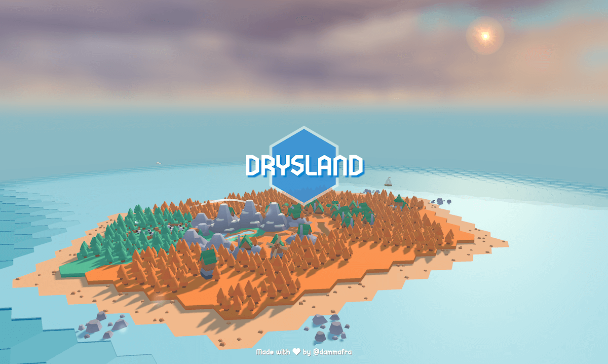
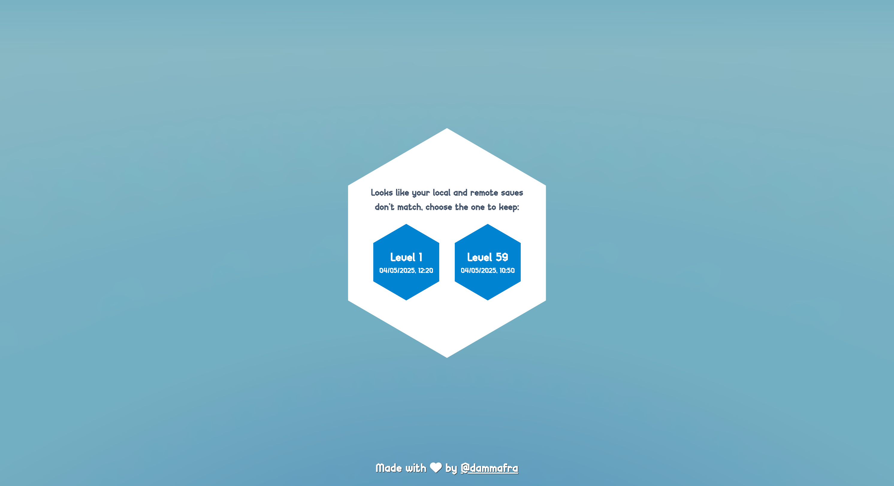
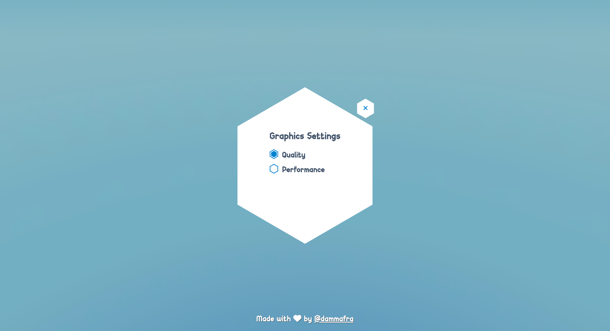
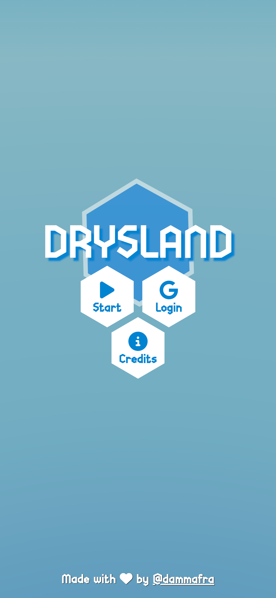
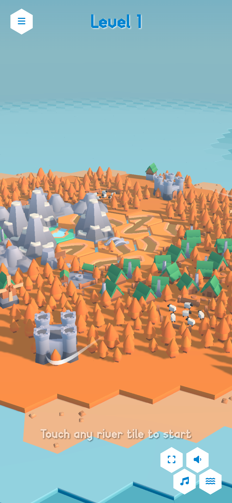
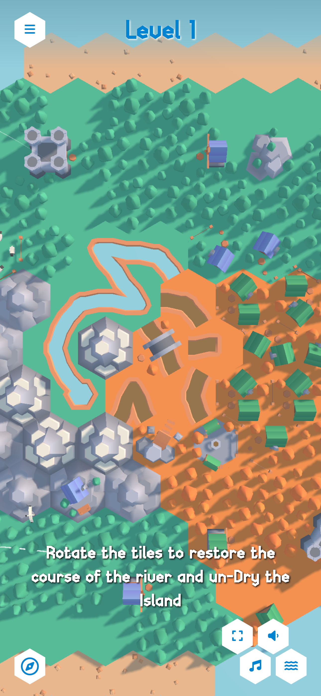
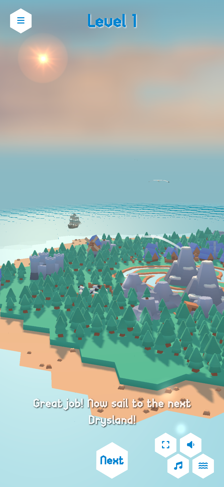
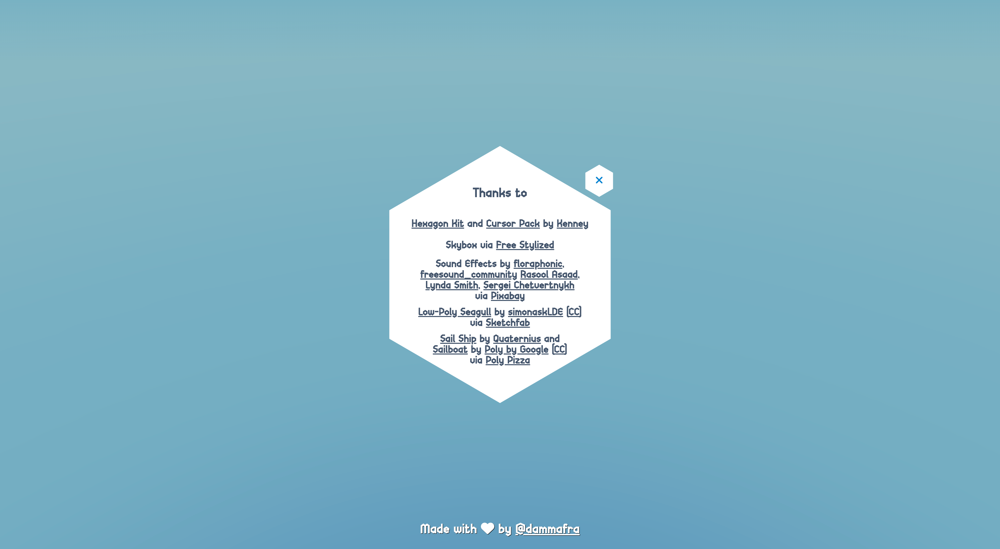

# 🏝️ Drysland


> Try it live here 👉 [drysland.vercel.app](https://drysland.vercel.app)

Inspired by classic **pipe-connection games**, Drysland is a relaxing, minimalist puzzle experience where you restore the flow of a river across a parched island by rotating and reconnecting its broken segments to bring water — and life — back to the land.

Each level in Drysland is a procedurally generated island that gradually increases in size and difficulty.
Pipe networks are created using a simplified version of the **Growing Tree algorithm**, ensuring each puzzle is both solvable and unique.



## Technologies Used

- [Three.js](https://threejs.org/) (3D rendering)
- [Tweakpane](https://tweakpane.github.io/docs/) (Debug)
- [@yomotsu/camera-controls](https://github.com/yomotsu/camera-controls) -[@pmndrs/pointer-events](https://www.npmjs.com/package/@pmndrs/pointer-events)
- [GSAP](https://gsap.com/)
- [Firebase](https://firebase.google.com/)
- [Tailwind](https://tailwindcss.com/)

## Setup

```bash
# Install dependencies (only the first time)
npm install

# Run the local server at localhost:5173
npm run dev

# Build for production in the dist/ directory
npm run build
```

## Features

TBD

### Save System & Sync



Drysland automatically saves your progress locally using the browser’s local storage, so you can pick up right where you left off.
For cross-device play, you can optionally log in with a Google account to sync your progress across multiple devices.
If differences are detected between the local and cloud save data, a simple conflict resolution system will help you choose which version to keep.

### Graphics Settings



Drysland offers a simple toggle between Performance and Quality modes. This setting adjusts shadows, water effects, and other visual details to strike a balance between smooth performance and visual fidelity. Your preference is saved and applied automatically each time you return.

### Mobile-Friendly

Drysland is optimized for mobile devices, providing a smooth and engaging experience on smartphones and tablets. It adapts to smaller screens, ensuring easy interaction and navigation on touch interfaces.

|                                                             |                                                               |                                                            |                                                                  |
| ----------------------------------------------------------- | ------------------------------------------------------------- | ---------------------------------------------------------- | ---------------------------------------------------------------- |
|  |  |  |  |

## Credits

Check out the credits section in the project for a full list of resources used



- **Hexagon Kit**  
  by [Kenney.nl](https://kenney.nl/assets/hexagon-kit)

- **Cursor Pack**  
  by [Kenney.nl](https://kenney.nl/assets/cursor-pack)

- **Happy Relaxing Loop Sound Effect**  
  by [Sergei Chetvertnykh](https://pixabay.com/users/sergequadrado-24990007/?utm_source=link-attribution&utm_medium=referral&utm_campaign=music&utm_content=275487) from [Pixabay](https://pixabay.com/sound-effects//?utm_source=link-attribution&utm_medium=referral&utm_campaign=music&utm_content=275487)

- **Swing Whoosh In Room 8**  
  by [floraphonic](https://pixabay.com/users/floraphonic-38928062/?utm_source=link-attribution&utm_medium=referral&utm_campaign=music&utm_content=234259) from [Pixabay](https://pixabay.com//?utm_source=link-attribution&utm_medium=referral&utm_campaign=music&utm_content=234259)

- **UI Pop Up 7**  
  by [floraphonic](https://pixabay.com/users/floraphonic-38928062/?utm_source=link-attribution&utm_medium=referral&utm_campaign=music&utm_content=197891) from [Pixabay](https://pixabay.com//?utm_source=link-attribution&utm_medium=referral&utm_campaign=music&utm_content=197891)

- **Multi Pop 1**  
  by [floraphonic](https://pixabay.com/users/floraphonic-38928062/?utm_source=link-attribution&utm_medium=referral&utm_campaign=music&utm_content=188165) from [Pixabay](https://pixabay.com//?utm_source=link-attribution&utm_medium=referral&utm_campaign=music&utm_content=188165)

- **Ocean Waves**  
  by [Lynda Smith](https://pixabay.com/users/missywhimsyart-4358466/?utm_source=link-attribution&utm_medium=referral&utm_campaign=music&utm_content=266187) from [Pixabay](https://pixabay.com/sound-effects//?utm_source=link-attribution&utm_medium=referral&utm_campaign=music&utm_content=266187)

- **Notification Sound**  
  by [Rasool Asaad](https://pixabay.com/users/rasoolasaad-47313572/?utm_source=link-attribution&utm_medium=referral&utm_campaign=music&utm_content=269266) from [Pixabay](https://pixabay.com//?utm_source=link-attribution&utm_medium=referral&utm_campaign=music&utm_content=269266)

- **Skybox**  
  from [Freestylized](https://freestylized.com/skybox/sky_42/)

- **Low-Poly Seagull (with Animation & Rigged)**  
  by [simonaskLDE](https://skfb.ly/orun9) [[CC](http://creativecommons.org/licenses/by/4.0/)] from [Sketchfab](https://sketchfab.com)

- **Sail Ship**  
  by [Quaternius](https://poly.pizza/m/cIzO4MBPqI) from [Poly Pizza](https://poly.pizza)

- **Sailboat**  
  by [Poly by Google](https://poly.pizza/m/1d76pfN4Dne) [[CC](https://creativecommons.org/licenses/by/3.0/)] from [Poly Pizza](https://poly.pizza)

## Feedback

If you have any suggestions, feel free to reach out!
